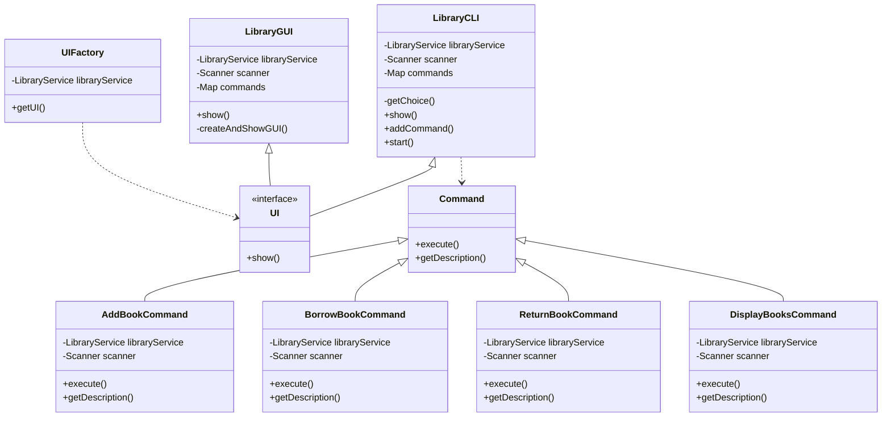

# UML

```mermaid
classDiagram
    
    LibraryCLI <|-- UI
    LibraryGUI <|-- UI
    UIFactory  ..> UI
    LibraryCLI ..> Command
    Command <|-- AddBookCommand
    Command <|-- BorrowBookCommand
    Command <|-- ReturnBookCommand
    Command <|-- DisplayBooksCommand
    
    
    class UIFactory {
    -LibraryService libraryService
    +getUI()
    }
    
    class UI {
    <<interface>>
    +show()
    }
    
    
    class Command {
    +execute()
    +getDescription()
    }
    
    class LibraryCLI {
    -LibraryService libraryService
    -Scanner scanner
    -Map<Interger,Command> commands
    -getChoice()
    +show()
    +addCommand()
    +start()
    }
    
    class LibraryGUI {
    -LibraryService libraryService
    -Scanner scanner
    -Map<Interger,Command> commands
    +show()
    -createAndShowGUI()
    }
    
    class AddBookCommand {
    -LibraryService libraryService
    -Scanner scanner
    +execute()
    +getDescription()
    }
    
    class BorrowBookCommand {
    -LibraryService libraryService
    -Scanner scanner
    +execute()
    +getDescription()
    }
    
    class ReturnBookCommand {
    -LibraryService libraryService
    -Scanner scanner
    +execute()
    +getDescription()
    }
    
    class DisplayBooksCommand {
    -LibraryService libraryService
    -Scanner scanner
    +execute()
    +getDescription()
    }
    
    
    
    
    
    
    


```
